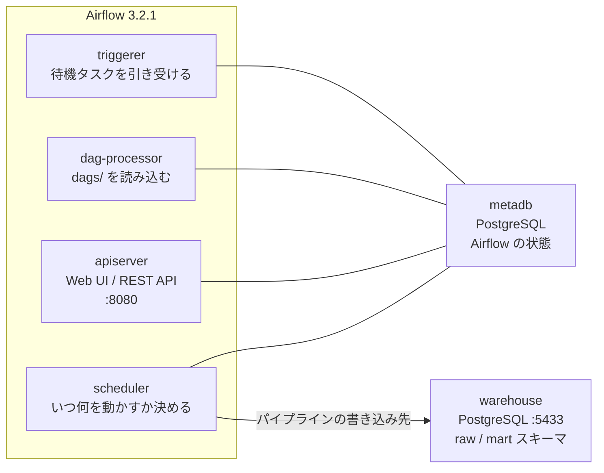

# データパイプライン実験室

Zenn の書籍「[手を動かして学ぶ Apache Airflow 実践入門 ― DAG 設計からデータパイプラインの本番運用・Amazon MWAA まで](https://zenn.dev/pakku8914/books/airflow_data_pipeline_training)」（近日公開）のコード例・練習問題を実際に動かして確認するための Docker 環境です。Apache Airflow 本体と、パイプラインの出力先になる分析用データベース（PostgreSQL）が一式そろっています。

## 構成



| コンテナ | 役割 | 備考 |
| :--- | :--- | :--- |
| `apiserver` | Web UI と REST API | `http://localhost:8080`（Airflow 3 では `webserver` ではなく `api-server`） |
| `scheduler` | スケジュール判定とタスク実行（LocalExecutor） | Celery / Redis は使わず軽量に動かす |
| `dag-processor` | `dags/` の Python を読んで DAG を登録 | Airflow 3 では独立プロセス |
| `triggerer` | Deferrable Operator の待機を引き受ける | Session 09 で使う |
| `metadb` | Airflow 自身の状態を保存 | 学習者が直接触ることはほぼない |
| `warehouse` | パイプラインの出力先の分析用DB | `raw` / `mart` スキーマ。ホストの `localhost:5433` から接続可 |
| `init` | DB マイグレーションと管理ユーザー作成 | 一度だけ動いて `Exited (0)` になる（正常） |

## 起動（One-step）

ホスト側のターミナルでリポジトリを取得し、このディレクトリ（`airflow_data_pipeline_training/`）に移動してから実行します。

```bash
git clone https://github.com/Pakku8914/zenn-ai-applied-sandbox.git
cd zenn-ai-applied-sandbox/airflow_data_pipeline_training
docker compose up -d
```

初回はイメージの取得に数分かかります。すべてのコンテナが立ち上がると、ブラウザで `http://localhost:8080` にアクセスできます（ユーザー名 `airflow` / パスワード `airflow`）。

`init` は役目を終えて `Exited (0)` になりますが、これは正常です。

## 動作確認

サンプル DAG `hello_pipeline` は最初から有効（`is_paused_upon_creation=False`）なので、起動から1分ほどで自動的に1回実行され、成功します。

```bash
# DAG が登録されているか
docker compose exec scheduler airflow dags list

# 実行結果（state が success になる）
docker compose exec scheduler airflow dags list-runs hello_pipeline

# パイプラインの書き込み結果
docker compose exec warehouse psql -U analyst -d warehouse \
  -c "SELECT * FROM raw.lab_healthcheck;"
```

同じ実行をクリアして再実行しても、`raw.lab_healthcheck` の行数は1行のまま増えません（冪等性の確認）。

```bash
docker compose exec scheduler airflow tasks clear -y hello_pipeline
docker compose exec warehouse psql -U analyst -d warehouse \
  -c "SELECT count(*) FROM raw.lab_healthcheck;"
```

## ディレクトリ

```text
airflow_data_pipeline_training/
├── compose.yaml            # 実験室全体の定義
├── .env.example            # 設定を上書きしたいときだけ .env にコピーする（任意）
├── dags/                   # DAG を置く場所（コンテナの /opt/airflow/dags）
│   └── hello_pipeline.py   # 動作確認用サンプル DAG
├── include/                # DAG から読む補助ファイル（コンテナの /opt/airflow/include）
│   └── seed/               # 練習用の注文データ CSV（3日分）
├── warehouse/init/         # 分析用DBの初期化SQL（初回起動時に1度だけ実行）
├── config/                 # airflow.cfg などの置き場（自動生成）
├── plugins/                # 自作プラグインの置き場
└── logs/                   # タスクログ（自動生成・Git 管理外）
```

## 停止・リセット

```bash
docker compose stop          # 止めるだけ（次回は up -d で再開）
docker compose down          # コンテナを削除（DB の中身はボリュームに残る）
docker compose down -v       # ボリュームも削除して完全リセット
```

`warehouse/init/*.sql` はボリュームの初回作成時にだけ実行されます。初期化SQLを変えたときは `docker compose down -v` してから起動し直してください。

## バージョン

| ソフトウェア | バージョン | 選定理由 |
| :--- | :--- | :--- |
| Apache Airflow | `apache/airflow:3.2.1-python3.12` | Amazon MWAA がサポートする最新版（2026年8月時点）と同一。ローカルと MWAA で挙動をそろえるため |
| PostgreSQL | `postgres:16-alpine` | メタデータDB・分析用DBの両方 |

すべて固定タグです（`latest` は使いません）。

## セキュリティに関する注意

- 公開ポートは `127.0.0.1` にのみバインドしています（同じネットワークの他人からは見えません）。
- `compose.yaml` に書かれている Fernet キー・JWT シークレット・DB パスワードは**学習用の固定値**です。実運用の環境にそのまま持ち込まないでください。安全な扱い方は Session 15 で扱います。
