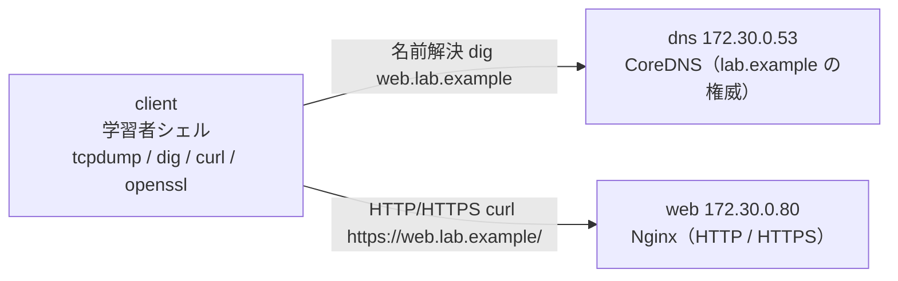

# プロトコル観察ラボ

Zenn の書籍「[手を動かして学ぶ コンピュータネットワーク実践入門 ― パケットで追う TCP/IP・HTTP・DNS・TLS の仕組み](https://zenn.dev/pakku8914/books/network_protocols_practical_training)」のコード例・練習問題を実際に動かして確認するための Docker 環境です。`tcpdump`・`dig`・`curl`・`openssl` などの観察ツールを備えたクライアントから、ラボ内の DNS サーバと Web サーバへ通信し、プロトコルの動きを「見える化」します。

## 構成



| コンテナ | 役割 | 備考 |
| :--- | :--- | :--- |
| `client` | 学習者が入るシェル | 観察ツール一式・`CAP_NET_RAW`（tcpdump 用） |
| `dns` | 内部ゾーン `lab.example` の DNS（CoreDNS） | `172.30.0.53`。外部名は公開リゾルバへ転送 |
| `web` | HTTP/HTTPS の観察対象（Nginx） | `172.30.0.80`。HTTPS は自己署名証明書 |
| `certgen` | 起動時に自己署名CA＋サーバ証明書を生成して終了 | `web` はこの完了を待って起動 |

## 起動（One-step）

ホスト側のターミナルで、このディレクトリ（`network_protocols_practical_training/`）に移動してから実行します。

```bash
git clone https://github.com/Pakku8914/zenn-ai-applied-sandbox.git
cd zenn-ai-applied-sandbox/network_protocols_practical_training
docker compose up -d --build
```

初回はイメージのビルドと証明書生成が走ります。`certgen` は証明書を作り終えると `exited (0)` になります（正常）。

## クライアントに入って観察する

```bash
docker compose exec client bash
```

クライアント内での確認例：

```bash
# DNS：lab.example の名前解決を観察
dig web.lab.example +short        # → 172.30.0.80 が返る

# HTTP：平文のやりとりを観察
curl -v http://web.lab.example/

# HTTPS：ラボCAを信頼してTLSで取得
curl -v --cacert /lab-certs/ca.crt https://web.lab.example/

# TLS：証明書チェーンとハンドシェイクを観察
openssl s_client -connect web.lab.example:443 -servername web.lab.example </dev/null

# パケットキャプチャ：DNS(53番)を5パケットだけ覗く
tcpdump -n -c 5 port 53
```

## 停止・リセット

```bash
docker compose stop          # 止めるだけ（次回は up -d で再開）
docker compose down          # コンテナとネットワークを削除（証明書は certs/ に残る）
docker compose down -v       # ボリュームも含め完全リセット
```

証明書を作り直したい場合は `certs/` 内の生成物（`*.crt` `*.key` など）を削除してから `docker compose up -d --build` し直してください。

## バージョン

| ソフトウェア | バージョン |
| :--- | :--- |
| クライアントベース | `debian:12-slim` |
| DNS | `coredns/coredns:1.11.3` |
| Web | `nginx:1.27-alpine` |

すべて固定タグです（`latest` は使いません）。
